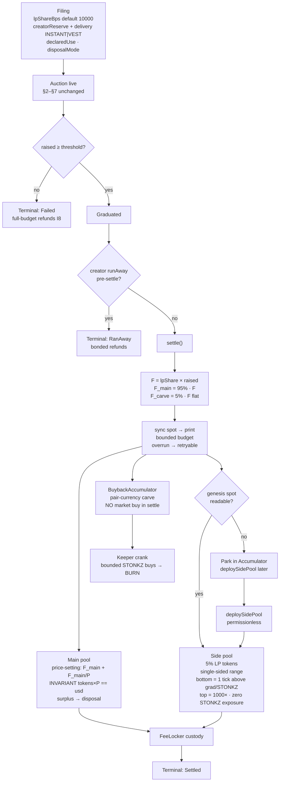

# Settlement — Milestone 3 flow (spec §8)

> Source of truth for settlement is `docs/mechanism-spec.md` §8 (v1.1).
> This document is the human-review STOP surface: flow, modules, and the M3.5 gate.

## Precondition (satisfied)

| Item | Value |
|---|---|
| Base | `lazy-flip` merged to `main` |
| Merge commit | `d7ec5bc` ([PR #1](https://github.com/trudeaudm/stonkz.green/pull/1)) |
| PR CI (green) | https://github.com/trudeaudm/stonkz.green/actions/runs/30162808261 |
| Main push CI (green) | https://github.com/trudeaudm/stonkz.green/actions/runs/30162961406 |

## Flow

## Module map

| Contract | Role |
|---|---|
| `StonkzLiquidityStrategy` | `settle()`: sync, 95/5, price-setting, surplus, side pool, conservation getters |
| `BuybackAccumulator` | Carve + fees + pre-genesis parking; permissionless crank with hardcoded cap/cooldown; burns |
| `FeeLocker` | Immutable custody; main pair-fees → accumulator / user-token → burn; side compounds |
| `CreatorReserveLib` | INSTANT (10-min window) / VEST linear; declaredUse |
| `v4/*` + `MockPoolManager` | Minimal internal v4 surface; dual-backend for C1/C2 |

## Defaults & framing

- `lpShareBps` default **10000** → canonical auction:LP = **56.5 : 43.5** at κ̂ = 1.3
- Raise-side opt-down = `treasuryReserve`; token-side = `creatorReserve`
- Reserves are **tools, not fees**; no "compensation" / "creator cut" copy
- Flat 5% carve on **all** launches (cliff-gaming rationale — no tiers)

## Suites

| ID | Suite | Backend | Status |
|---|---|---|---|
| C1 | `PoolSeamAttacks` | mock (dual-backend harness) | **provisional** (M3.5 → real v4) |
| C2 | `SidePoolEconomics` | mock (dual-backend harness) | **provisional** (M3.5 → real v4) |
| C3 | `BuybackAccumulator` | 1:1 mock conversion | **partially provisional** — crank bounds/burn/park gate on mock; conversion path re-validated against a real pool in M3.5 |
| C4 | `TerminalState` | — | gate |
| C5 | `SettlementConservation` (100% LP) | mock | gate (price-setting + naive-full-range asserted on mock; real-v4 copies are M3.5) |
| C6 | `Reserves` | — | gate |

Plus: reference 19/19, 200-vector fuzz seed 4663, §9 invariant campaign.

### C5 named tests (already shipped on mock)

| Assertion | Test name | File |
|---|---|---|
| Price-setting ratio `tokens × P == usd` | `test_C5_priceSettingInvariant` | `SettlementConservation.t.sol` |
| Full-range all-tokens deposit unreachable | `test_C5_naiveFullRangeUnreachable` | `SettlementConservation.t.sol` (hooks `assertNaiveFullRangeUnreachable` / `NaiveFullRangeForbidden`) |

## M3.5 — REQUIRED before testnet

C1/C2 green on `MockPoolManager` does **not** prove tick math, sync-swap, or
front-created pool behavior against real Uniswap v4. C3's buy path is only
partially proven (1:1 mock conversion). M3.5 must:

1. Vendor `v4-core` (+ periphery as needed)
2. Re-run C1 and C2 **unmodified** against the real `PoolManager`
3. Assert **price-setting ratio** (`tokens × P == usd`) with a **named test against real v4** (mock already has `test_C5_priceSettingInvariant`)
4. Re-run / keep **`test_C5_naiveFullRangeUnreachable`** (full-range all-tokens deposit unreachable) against real v4 — already exists under that name; do not invent a duplicate
5. Re-validate C3's **conversion path** against a real STONKZ4663 pool (bounds/cooldown/burn stay; drop the 1:1 mock assumption)
6. Land before any testnet deploy

M3.5 may run **in parallel with Milestone 4** per M3 review acceptance.

## Deployment-ladder preconditions (M3 review — bind testnet)

Promoted from M3 STOP open items #3/#4. **Testnet deploy is blocked until both are true:**

1. **Factory token custody at construction** — the factory/manager mints the
   user token and wires custody before auction start; `userToken` is not a
   settle-time afterthought.
2. **Production filings REVERT on `liquidityStrategy == address(0)`** — the
   zero-address accounting-only fallback is test-only; live filings must
   point at a deployed `StonkzLiquidityStrategy`.

See `docs/launch-plan.md` §8 deployment ladder + decisions log.

## B6 vector report

**No section-A vectors regenerated.** All canonical / fuzz scenarios already set
`lpSharePct` / `lpShareBps` explicitly; only the engine/simulator *default* when
the param is omitted changed (80 → 100). Auction-engine vectors byte-unchanged.
